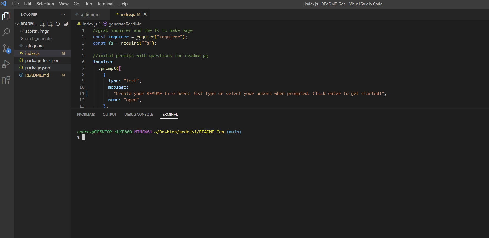
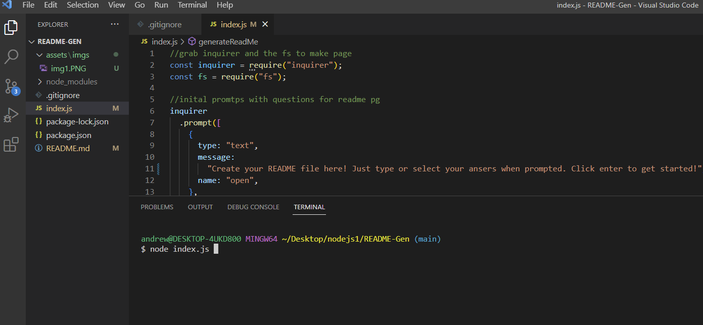
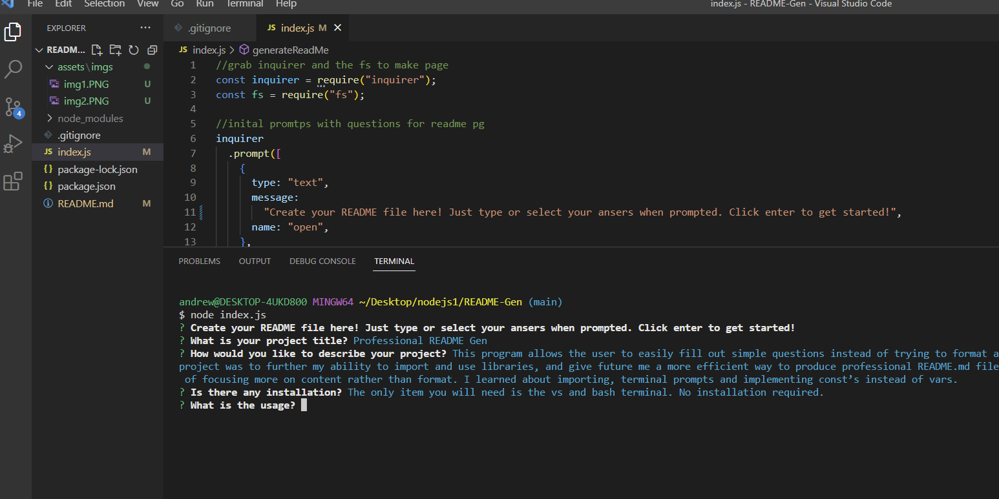
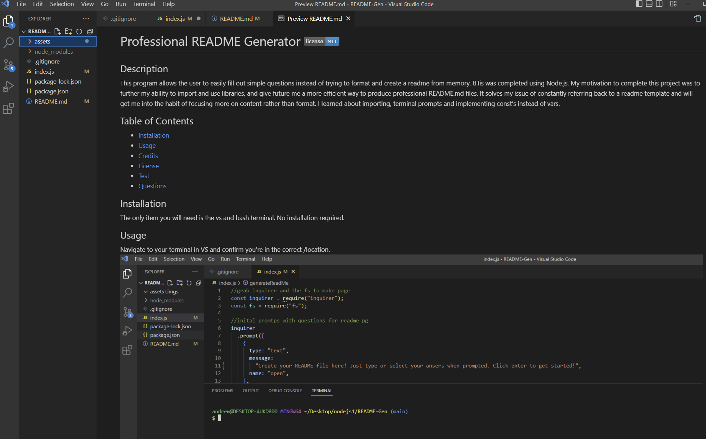

# Professional README Generator 

## Description

This program allows the user to easily fill out simple questions instead of trying to format and create a readme from memory. tHis was completed using Node.js. My motivation to complete this project was to further my ability to import and use libraries, and give future me a more efficient way to produce professional README.md files. It solves my issue of constantly referring back to a readme template and will get me into the habit of focusing more on content rather than format. I learned about importing, terminal prompts and implementing const’s instead of vars.

## Table of Contents

- [Installation](#installation)
- [Usage](#usage)
- [Credits](#credits)
- [License](#license)
- [Test](#tests)
- [Questions](#questions)

## Installation

The only item you will need is the vs and bash terminal. No installation required.

## Usage

Navigate to your terminal in VS and confirm you’re in the correct /location.

Simply input the node index.js to prompt the program start.

Answer the prompts then click enter.

Enjoy your new complete README.md!

## Credits

https://github.com/hannahhue

No other contributers at this time.

## Tests

I tested this program by creating my own personalREADME.md.

watch link: https://watch.screencastify.com/v/tr2y1XuJU6zpmLbNBptL

## Questions

The best way to reach me is by following up by email, or send me a follow and message on my Github!

Email: alicia9790972@gmail.com

Github: https://github.com/hannahhue

## License

The MIT license gives users express permission to reuse code for any purpose,
sometimes even if code is part of proprietary software. As long as users include the original copy of the MIT license in their distribution,
they can make any changes or modifications to the code to suit their own needs.
